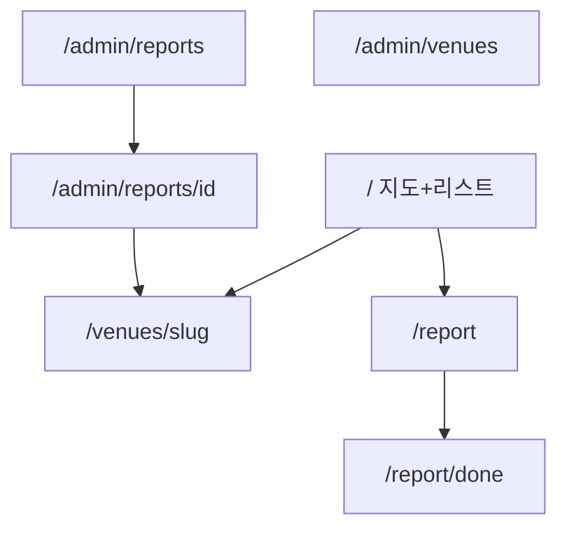

# 하이록스 맵 — 와이어프레임

ASCII 와이어프레임. 구현 경로: `src/app/*`

---

## 1. 메인 — 지도 + 리스트 (`/`)

```
┌─────────────────────────────────────────┐
│ [로고] 하이록스 맵          [제보하기]   │
│ 비공식 커뮤니티 지도 · HYROX와 무관      │
├─────────────────────────────────────────┤
│ 🔍 시설명·지역·역 검색                  │
│ [필터▾] [드랍인만] [야외런] [슬래드]     │
├──────────────────┬──────────────────────┤
│                  │ ┌─ 리스트 ─────────┐ │
│                  │ │ ● F45 강남  1.2km│ │
│     [  지도  ]   │ │   공식 · 슬래드   │ │
│     마커 클러스터 │ │ ○ 헤이데이  2.1km│ │
│                  │ │   야외런·스테이션 │ │
│                  │ └──────────────────┘ │
│                  │ (모바일: 하단 시트)  │
├──────────────────┴──────────────────────┤
│ 📍 내 위치로          [지도|리스트] 토글 │
└─────────────────────────────────────────┘
```

**인터랙션**

- 위치 권한 거부 시 → 서울 시청 기본 + “위치 허용” CTA
- 마커 탭 → 하단 카드 스냅
- 리스트 탭 → `/venues/[slug]`

---

## 2. 필터 시트 (`FilterSheet`)

```
┌─────────────────────────────────────────┐
│ 필터                          [초기화] │
├─────────────────────────────────────────┤
│ 지역: [서울 ▾] [구 선택 ▾]              │
│ 시설 유형:                              │
│  □ 공식클럽 □ 크로스핏 □ 하이록스센터   │
│ 신뢰도: □ 공식 □ 검증됨 □ 커뮤니티      │
│ 장비/환경:                              │
│  □ 야외런 □ 슬래드 □ 스키에르고 ...     │
│ □ 드랍인 가능만                         │
├─────────────────────────────────────────┤
│              [ N개 장소 보기 ]          │
└─────────────────────────────────────────┘
```

---

## 3. 시설 상세 (`/venues/[slug]`)

```
┌─────────────────────────────────────────┐
│ ← 뒤로                    [공유] [♡]   │
├─────────────────────────────────────────┤
│ F45 Training 강남                       │
│ [공식 HYROX] · 크로스핏/공식클럽        │
│ 서울 강남구 · 1.2km                     │
├─────────────────────────────────────────┤
│ [슬래드] [로잉] [스키에르고] [실내런]   │
├─────────────────────────────────────────┤
│ 드랍인: 토요일 시뮬 클래스 문의         │
│ 가격: (미확인 시 비움)                  │
│ 야외런: —                               │
├─────────────────────────────────────────┤
│ [네이버지도] [카카오맵] [예약/홈페이지] │
├─────────────────────────────────────────┤
│ 정보가 틀려요? [수정 제보] [신고]       │
└─────────────────────────────────────────┘
```

---

## 4. 제보 폼 (`/report`)

```
┌─────────────────────────────────────────┐
│ 시설 제보하기                           │
│ 검수 후 3~5영업일 내 반영됩니다.        │
├─────────────────────────────────────────┤
│ 시설명 *                                │
│ 주소 *        [지도에서 핀 찍기]        │
│ 시설 유형 *  (라디오)                   │
│ 체험 내용 *  (textarea)                 │
│   예: 야외런 + 실내 스테이션 가능       │
│ 가능한 환경 * (태그 체크박스)           │
│ 증빙 URL *  (사진·예약캡처 링크)        │
│ [ + 증빙 추가 ]                         │
│ 드랍인 정보 (선택)                      │
│ 연락처 (선택, 검수 알림용)              │
│ □ 개인정보 수집 동의 *                  │
├─────────────────────────────────────────┤
│              [ 제보 제출 ]              │
└─────────────────────────────────────────┘
```

**제출 후** → `/report/done?id=xxx` — 제보 ID 표시, 진행 조회 안내 (v1.1)

---

## 5. Admin — 제보 큐 (`/admin/reports`)

```
┌─────────────────────────────────────────┐
│ Admin · 제보 큐              [로그아웃] │
├─────────────────────────────────────────┤
│ [submitted:12] [in_review:3] [all]    │
├─────────────────────────────────────────┤
│ #104 헤이데이 크로스핏    submitted 2h │
│   성동구 · 야외런,슬래드 · ⚠ 중복 50m   │
│   [검수 열기]                           │
├─────────────────────────────────────────┤
│ #103 ○○박스              in_review     │
│   ...                                   │
└─────────────────────────────────────────┘
```

---

## 6. Admin — 제보 상세 검수 (`/admin/reports/[id]`)

```
┌─────────────────────────────────────────┐
│ 제보 #104                               │
├──────────────┬──────────────────────────┤
│ 제보 내용    │ [지도 미리보기]          │
│ 증빙 이미지  │ 기존 Venue 중복?         │
│ 제보자 메모  │                          │
├──────────────┴──────────────────────────┤
│ 운영자 메모 (내부)                      │
│ 제보자 안내 (반려/보완 시)              │
│ trust_level: ○ verified ○ community   │
├─────────────────────────────────────────┤
│ [보완요청] [반려] [승인 → Venue 생성]   │
└─────────────────────────────────────────┘
```

---

## 7. Admin — 시설 CRUD (`/admin/venues`)

```
┌─────────────────────────────────────────┐
│ 시설 관리              [+ 새 시설]      │
│ [검색] [공식만] [미공개]                │
├─────────────────────────────────────────┤
│ slug | 이름 | trust | published | 편집  │
└─────────────────────────────────────────┘
```

---

## 8. 화면 맵



---

## 9. 반응형

| 뷰포트 | 지도/리스트 |
|--------|------------|
| Desktop | 좌 60% 지도 / 우 40% 리스트 |
| Mobile | 전체 지도 + 하단 draggable 시트 리스트 |

---

## 10. 컴포넌트 매핑

| 와이어프레임 | 컴포넌트 |
|-------------|----------|
| 지도 | `MapView`, `VenueMarkers` |
| 리스트 | `VenueList`, `VenueCard` |
| 필터 | `FilterSheet` |
| 제보 | `ReportForm` |
| Admin | `ReportQueue`, `ModerationPanel` |
